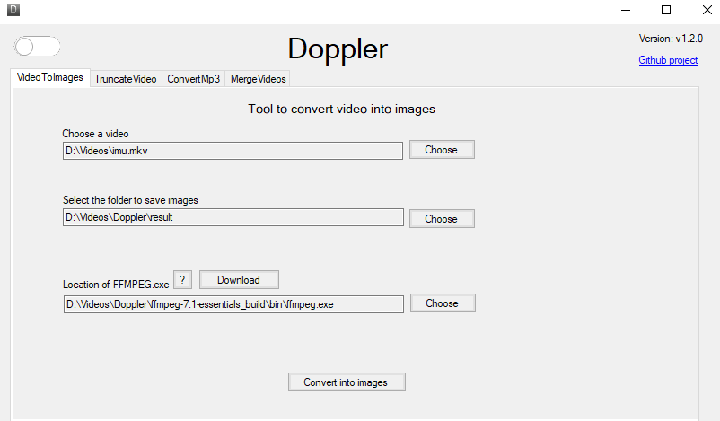
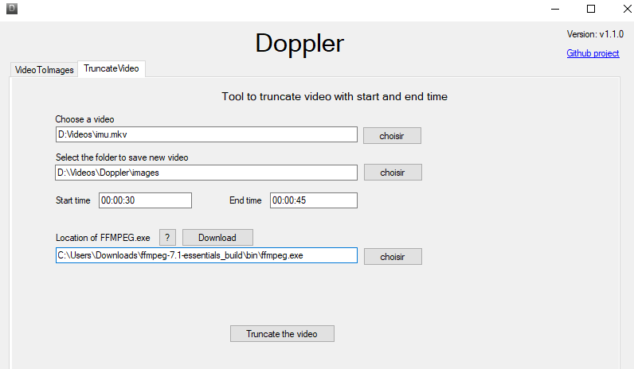
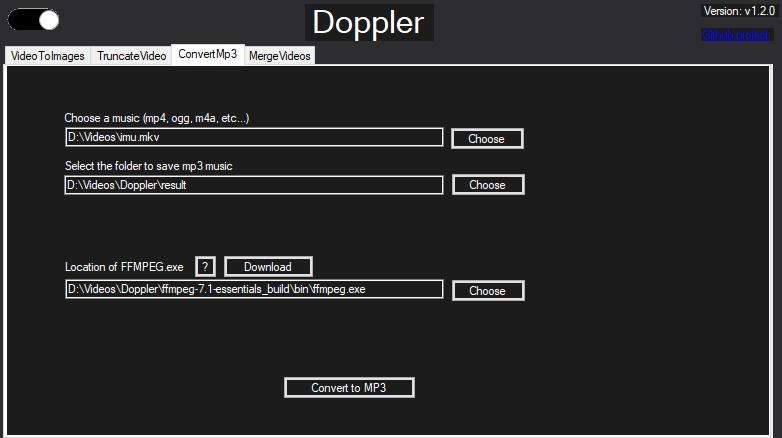
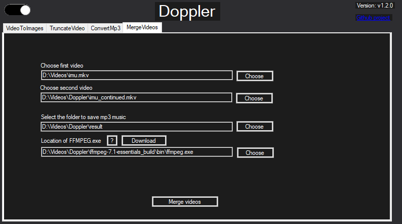
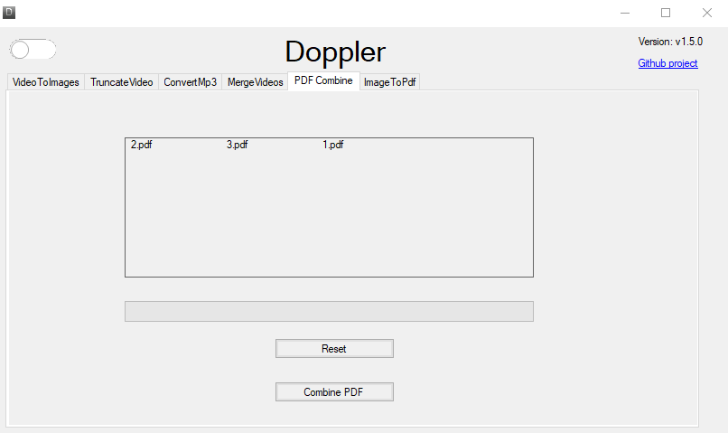
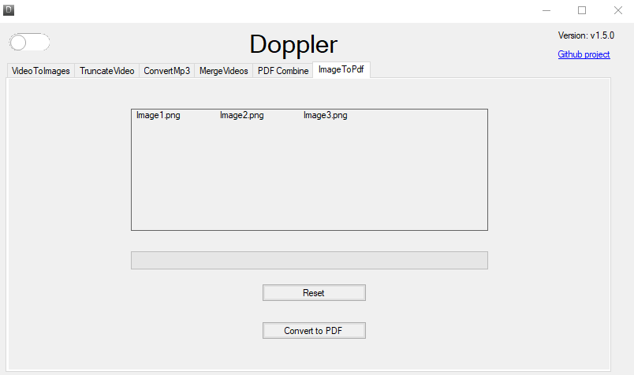

<h1 style="text-align:center;" >  Doppler</h1>

  
     

  

      

## Summary

- [User Guide](#user-guide)
- [Requirements](#requirements)
- [Get started](#get-started)
- [Contact](#contact)
- [Credits](#credits)

## User Guide

This application can

- screen captures periodically from video  
  

- Truncate video with start and end time  
  
- Convert any audio/video format to mp3/mp4  
  
- Concatenate two videos  
  
- Combine pdf files  
  
- Convert images to pdf  
  

1. Download `DopplerSetup.msi` project from [this link](https://github.com/NY-Daystar/Doppler/releases/download/v1.7.0/DopplerSetup.msi)

2. Execute it

3. Launch Doppler

## Requirements

- [.NET Framework](https://dotnet.microsoft.com/en-us/download/dotnet/7.0) >= 7.0
- For developpment: [VS 2022](https://visualstudio.microsoft.com/fr/vs/) >= 2022

## Get started

1. Download `Doppler` project from [this link](https://github.com/NY-Daystar/Doppler/releases/download/v1.7.0/Doppler-portable)

2. Extract zip on your computer

3. Launch `Doppler.exe`
    - The project ask you to choose a folder in your computer to rename files.
    - It will list folder files and submit several renaming.
    - After choosing one the application rename files automatically

4. You will need to download FFMPEG from this link : https://www.gyan.dev/ffmpeg/builds/#release-builds  
   or download now with this link : https://www.gyan.dev/ffmpeg/builds/ffmpeg-release-essentials.zip

## Contact

- To make a pull request: https://github.com/NY-Daystar/doppler/pulls
- To summon an issue: https://github.com/NY-Daystar/doppler/issues
- For any specific demand by mail: [luc4snoga@gmail.com](mailto:luc4snoga@gmail.com?subject=[GitHub]%doppler%20Project)

## Credits

Made by Lucas Noga.  
Licensed under GPLv3.
